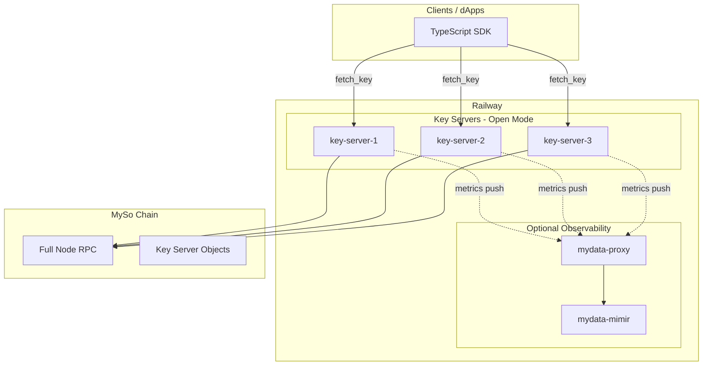

# Railway Deployment

This guide walks you through deploying MyData key servers on [Railway](https://railway.app) for production. It covers three standalone Open-mode key servers, with optional observability (mydata-proxy and Mimir).

## Architecture Overview

MyData uses a **threshold encryption** model: clients encrypt with `t` of `n` key servers. For Open mode with 3 servers, a typical setup is `threshold = 2` (any 2 of 3 servers can provide decryption keys).



## Prerequisites

- **MySo CLI** installed ([installation guide](https://docs.mysocial.network/guides/developer/getting-started/myso-install))
- **Wallet** with gas on MySo (Testnet or Mainnet)
- **Railway** account and project
- **GitHub** repo connected

## Network Configuration

| Network | MyData Package ID | Default RPC |
| ------- | ----------------- | ----------- |
| Testnet | `0x927a54e9ae803f82ebf480136a9bcff45101ccbe28b13f433c89f5181069d682` | `http://fullnode.testnet.mysocial.network:9000` |
| Mainnet | `0xa212c4c6c7183b911d0be8768f4cb1df7a383025b5d0ba0c014009f0f30f5f8d` | (check MySo docs) |

## Part 1: Generate Keys and Register On-Chain

### Step 1.1: Generate keys locally

```bash
cd myso-mydata
cargo run --bin mydata-cli genkey
```

Run this **3 times** for 3 key servers. Save each output:

```
Master key: <MASTER_KEY_1>
Public key: <PUBLIC_KEY_1>
```

### Step 1.2: Register each key server on-chain

For each key server, you need:

- **Server name** (e.g. `myso-mydata-server-1`)
- **Public URL** (Railway will assign this after deploy; use a placeholder first, then update)
- **Public key** from Step 1.1

```bash
myso client switch --env testnet   # or mainnet
myso client active-address
myso client gas

# Replace placeholders with your values
myso client call --function create_and_transfer_v1 --module key_server \
  --package <MYDATA_PACKAGE_ID> \
  --args <SERVER_NAME> https://<YOUR_RAILWAY_URL>.up.railway.app 0 <PUBLIC_KEY>
```

**Output:** `KEY_SERVER_OBJECT_ID` for each server. Save these.

## Part 2: Create Key Server Config for Railway

Each key server needs a config file. Copy the example template and customize:

```bash
cp key-server-config-railway.example.yaml key-server-config-railway.yaml
```

Edit `key-server-config-railway.yaml` for each service:

```yaml
network: Testnet   # or Mainnet
node_url: http://fullnode.testnet.mysocial.network:9000

server_mode: !Open
  key_server_object_id: '<KEY_SERVER_OBJECT_ID>'
```

:::important

Use the correct `key_server_object_id` per server. Each of the 3 services gets its own config with its own object ID.

:::

## Part 3: Railway Service Setup

### Option A: Railway Dashboard (recommended)

1. **Create 3 services** from the same repo
2. **Build:** Dockerfile path = `Dockerfile` (root)
3. **Environment variables** (per service):

| Variable | Value | Notes |
| -------- | ----- | ----- |
| `PORT` | `8080` | Railway sets this; key server reads it |
| `CONFIG_PATH` | `/app/config/key-server-config-railway.yaml` | Config path (auto-generated if missing) |
| `KEY_SERVER_OBJECT_ID` | `<from Step 1.2>` | **Required** when config is auto-generated |
| `MASTER_KEY` | `<secret>` | From Step 1.1 - **use Railway Secrets** |
| `RUST_LOG` | `info` | Optional |
| `NODE_URL` | `https://fullnode.testnet.mysocial.network:443` | Override if needed |

4. **Config file:** Either (a) add a volume at `/app/config` with `key-server-config-railway.yaml`, or (b) set `KEY_SERVER_OBJECT_ID` — the entrypoint will auto-generate the config when the file is missing. **Important:** Use `startCommand = "/opt/key-server/entrypoint.sh"` (not the binary directly) so the entrypoint runs and can generate config when needed.
5. **Health check:** `GET /health` (use `/health`, not `/v1/service` — the latter requires a `service_id` query param)
6. **Generate public URL:** Enable "Generate Domain" for each service

### Option B: Railway Config Files

Reference the provided config files:

- [railway-mydata-key-server-1.toml](https://github.com/The-Social-Proof-Foundation/myso-mydata/blob/main/railway-mydata-key-server-1.toml)
- [railway-mydata-key-server-2.toml](https://github.com/The-Social-Proof-Foundation/myso-mydata/blob/main/railway-mydata-key-server-2.toml)
- [railway-mydata-key-server-3.toml](https://github.com/The-Social-Proof-Foundation/myso-mydata/blob/main/railway-mydata-key-server-3.toml)

:::warning

`MASTER_KEY` must be set as a **secret** in Railway. When using an empty volume, set `KEY_SERVER_OBJECT_ID` so the entrypoint can auto-generate the config.

:::

## Part 4: Post-Deploy — Update On-Chain URLs

After deploy, Railway assigns URLs like `https://mydata-key-server-1-production.up.railway.app`. Update each key server object on-chain:

```bash
myso client call --function update --module key_server \
  --package <MYDATA_PACKAGE_ID> \
  --args <KEY_SERVER_OBJECT_ID> https://<YOUR_RAILWAY_URL>.up.railway.app
```

## Part 5: Optional Observability

### mydata-proxy

Collects metrics from key servers and pushes to Mimir. See [mydata-proxy-config-railway.yaml](https://github.com/The-Social-Proof-Foundation/myso-mydata/blob/main/mydata-proxy-config-railway.yaml).

- **Build:** `Dockerfile.mydata-proxy`
- **Ports:** 8000 (listen), 9185 (metrics), 8001 (histogram)
- **Config:** Update `remote-write.url` to your Mimir URL

### Mimir

- **Build:** Use `Dockerfile.mimir` or Grafana Mimir image
- **Config:** [mimir-railway.yaml](https://github.com/The-Social-Proof-Foundation/myso-mydata/blob/main/mimir-railway.yaml)

### Key server metrics push

In each key server config, add:

```yaml
metrics_push_config:
  bearer_token: "<SECRET>"
  push_interval_secs: 10
  push_url: "https://<mydata-proxy-url>.up.railway.app/publish/metrics"
```

## Part 6: Verification

1. **Health:** `curl https://<key-server-url>.up.railway.app/health`
2. **CLI test:** Use `mydata-cli fetch-keys` with your key server object IDs and network
3. **SDK:** Use `@socialproof/mydata` with your key server URLs in client config

## Checklist for Production

- [ ] **Secrets:** Never commit `MASTER_KEY`; use Railway Secrets
- [ ] **Config:** Each key server has its own `key_server_object_id`
- [ ] **Network:** Use correct `node_url` for Testnet/Mainnet
- [ ] **CORS:** Key server allows CORS for browser clients (see [Key Server Operations](/KeyServerOps))
- [ ] **Backup:** Securely store `MASTER_KEY` for each server (disaster recovery)

## Troubleshooting

| Issue | Cause | Fix |
| ----- | ----- | --- |
| Build failed | Missing deps | Ensure `Cargo.toml` and `Cargo.lock` are present |
| Config not found | Volume mount | Verify config path and volume mount |
| Health check fails | Wrong path or port | Use `/health` for healthcheck (not `/v1/service`); key server uses `PORT` env |
| Policy check fails | Wrong network | Verify `node_url` and `network` match |

## Related Documentation

- [Key Server Operations](/KeyServerOps) — Open vs Permissioned modes
- [Key Server Committee Ops](/KeyServerCommitteeOps) — Committee/aggregator setup
- [Aggregator](/Aggregator) — MPC committee aggregator
- [Design](/Design) — MyData architecture
